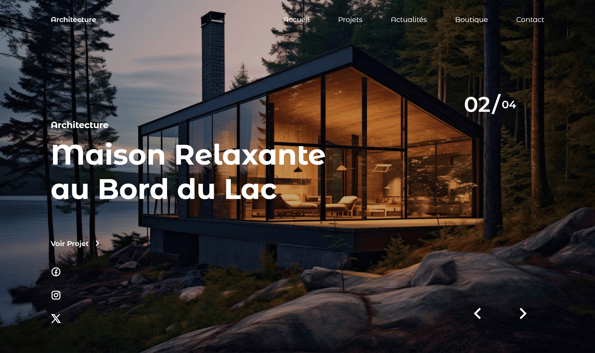

<div align="center">  
    <a href="https://architecte-firm.netlify.app/" target="_blank">  
    <!-- <a href="https://background-animation-architect.netlify.app/" target="_blank">  -->
        
    </a>
    </br>  
    </br>  
<h3 align="center">🏛️ Page Architecte – Slider Visuel Haut de Gamme</h3></div>

## <br /> 📌 Sommaire

&nbsp;&nbsp;&nbsp; 🎨 &nbsp; [**Introduction**](#introduction)<br />
&nbsp;&nbsp;&nbsp; 🛠️ &nbsp; [**Technologies**](#technologies)<br />
&nbsp;&nbsp;&nbsp; 🎯 &nbsp; [**Fonctionnalités**](#fonctionnalités)<br />
&nbsp;&nbsp;&nbsp; 🚀 &nbsp; [**Installation**](#installation)<br />

## <br /> <a name="introduction">🎨 Introduction</a>

Création d'une landing page moderne et minimaliste pour un architecte, développée en **HTML**, **CSS** et **JavaScript**. Enrichie d'animations fluides grâce à **Swiper.js.**

Galerie animée de projets architecturaux modernes avec navigation fluide par **Swiper.js**.  
Chaque slide présente une maison design avec titre, description et bouton “Voir Projet”.

Parfait pour des portfolios professionnels, studios d’architecture ou agences créatives.

## <br /> <a name="technologies">🛠️ Technologies</a>

- HTML5 sémantique
- CSS3 avancé (typographie, media queries, parallax)
- JavaScript ES6
- [Swiper.js](https://swiperjs.com/) pour carrousel avec effet fade & pagination
- Remix Icons pour les pictogrammes

## <br /> <a name="fonctionnalités">🎯 Fonctionnalités</a>

- Carrousel plein écran avec effet de transition fade
- Parallax fluide sur les textes et images
- Pagination fractionnée personnalisée
- Navigation via boutons suivant / précédent
- Intégration de liens sociaux persistants
- Design sombre, moderne et responsive
- Navigation mobile animée
- Structure modulaire pour projet créatif

## <br /> <a name="installation">🚀 Installation</a>

### ✅ Prérequis

- [Google Chrome](https://www.google.com/) — Navigateur moderne
- [Visual Studio Code](https://code.visualstudio.com/) — Éditeur de code
- [Live Server](https://marketplace.visualstudio.com/items?itemName=ritwickdey.LiveServer) — Extension VS Code

### 📥 Cloner le projet

```bash
git clone https://github.com/ValentinMadiot/background-animation-architect_js
cd background-animation-architect_js
```

### ▶️ Lancer le projet

Il suffit d’ouvrir le fichier `index.html` dans ton navigateur, ou d’utiliser **Live Server** pour un rendu interactif en local.
